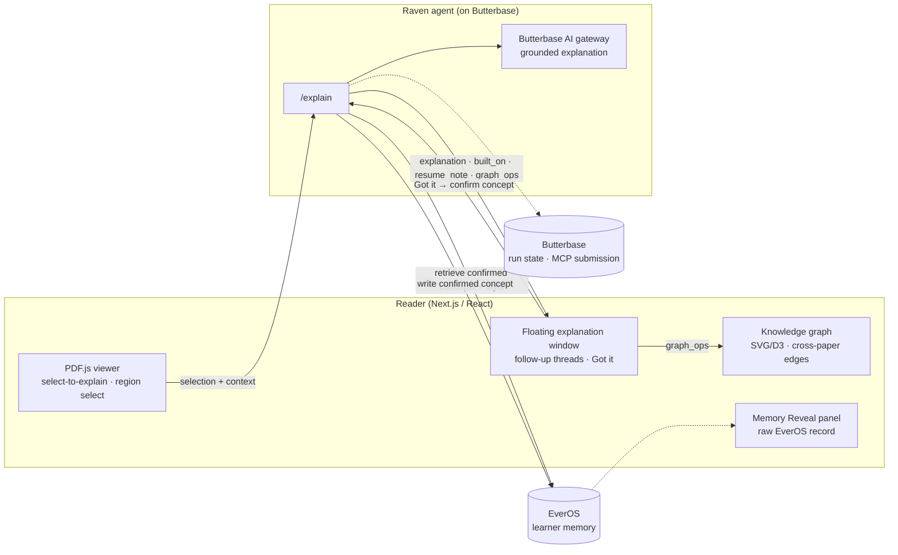

# Gloss — Tech Stack & Architecture

> Companion to [README.md](README.md) (hackathon build spec) and [gloss-spec.md](gloss-spec.md) (product vision).
> This documents the stack and system shape; the reader UI is already built and is not rebuilt during the hackathon.

---

## Tech stack

| Layer | Technology | Role |
|---|---|---|
| Reader UI | **Next.js / React** | Full-width reading app; floating, draggable explanation window; notes panel |
| PDF rendering | **PDF.js** | Document rendering, text selection (select-to-explain), region select for figures/equations |
| Knowledge graph | **React + SVG/D3 force layout** | Live concept graph; mastered vs open states; animated cross-paper edges |
| Agent orchestration | **Raven** | The `/explain` endpoint is a Raven agent: retrieve → ground → personalize → write |
| Learner memory | **EverOS** | Persistent learner profile, confirmed/shaky concepts, style preferences, session history |
| Model | **Butterbase AI gateway** | Single chat endpoint for grounded explanations (vision support for figure reading to be confirmed) |
| Backend, run state & submission | **Butterbase** | Backend hosting, run-state storage; mandatory MCP submission for judging |
| Hosting (frontend) | **Local for demo** | Reader runs locally; all server-side pieces live on Butterbase — no Nebius |
| Client persistence | Browser local storage | Highlights and notes (current reader behavior) |

---

## System overview



---

## The integration seam: `/explain`

One API call is the entire boundary between frontend and backend. The frontend never
reasons about memory; the agent never reasons about rendering.

**Request (frontend → Raven):**

```json
{
  "learner_id": "sam",
  "paper_id": "rl_paper_2",
  "selection": "temporal-difference error",
  "context": "…surrounding passage text…",
  "mode": "explain"
}
```

**Response (Raven → frontend):**

```json
{
  "explanation": "…explained through concepts the learner already confirmed…",
  "grounded": true,
  "built_on": [{ "concept": "reward_signal", "from_paper": "Embodied Neurocomputation" }],
  "resume_note": "Last session you were working through RL basics — picking up there.",
  "new_concept": { "concept": "td_error", "understanding": "…", "status": "pending" },
  "graph_ops": [
    { "op": "add_node", "id": "td_error", "state": "open" },
    { "op": "add_edge", "from": "td_error", "to": "reward_signal", "kind": "cross_paper" }
  ]
}
```

| Field | Drives |
|---|---|
| `built_on` | "Building on what you learned in [paper]" label |
| `resume_note` | Session resume ("picks up where the last session ended") |
| `graph_ops` | Graph rendering — frontend applies ops verbatim, never derives them |
| `new_concept.status` | `pending → confirmed` on the **Got it** tap |

This contract lets the frontend build against a mocked response while the real Raven
path is built behind the same shape, integrating once at the end.

---

## The memory loop (Raven agent)

On each `/explain` call, the agent:

1. **Retrieves** the learner's relevant *confirmed* concepts + style preferences from EverOS
2. **Separates** the current passage from retrieved knowledge
3. **Explains** — grounded in the passage, built on prior concepts, in the learner's style (via the Butterbase AI gateway)
4. **Resumes** — attaches a note from the last session
5. **Returns** `built_on`, `graph_ops`, and a `new_concept` (status `pending`)
6. **Writes back** — on **Got it**, the confirmed concept persists to EverOS

**Trust guardrail:** memory shapes *how* it explains (level, style, what to build on);
the passage supplies *what*. The agent never invents facts or citations and hedges
uncertainty.

**Self-evolving path (curveball):** a confirmed concept can be downgraded live when the
learner signals struggle, triggering a simpler re-explanation on the next pass.

---

## Data flow

```
Document → selection → context capture
  → Raven retrieves EverOS memory
  → grounded + personalized explanation (Butterbase AI gateway)
  → graph update (graph_ops)
  → learner confirms understanding (Got it)
  → EverOS write
  → next paper builds on confirmed concepts → cross-paper edge
```

Concept states: `open` (introduced) → `pending` (explained, awaiting confirmation) →
`confirmed` (learner tapped Got it) — with a downgrade path back to `shaky` on struggle.

---

## Repository layout

Currently docs-only; application code lands during the hackathon build.

```
.
├── README.md         # Hackathon build spec (source of truth for build day)
├── gloss-spec.md     # Full product vision
├── ARCHITECTURE.md   # This file
└── LICENSE
```
